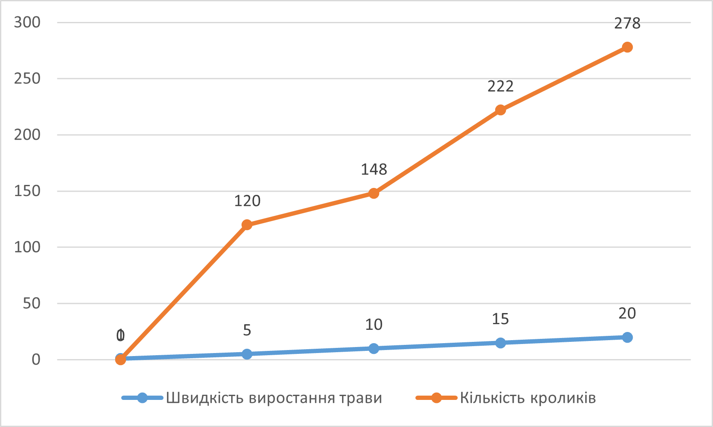
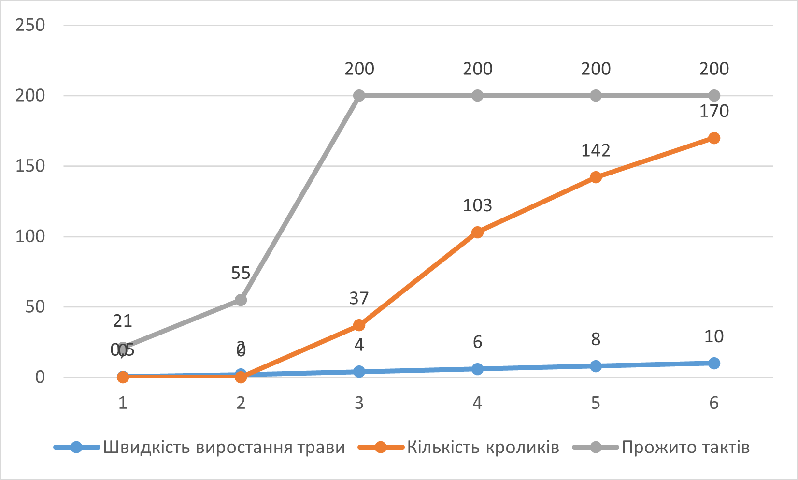
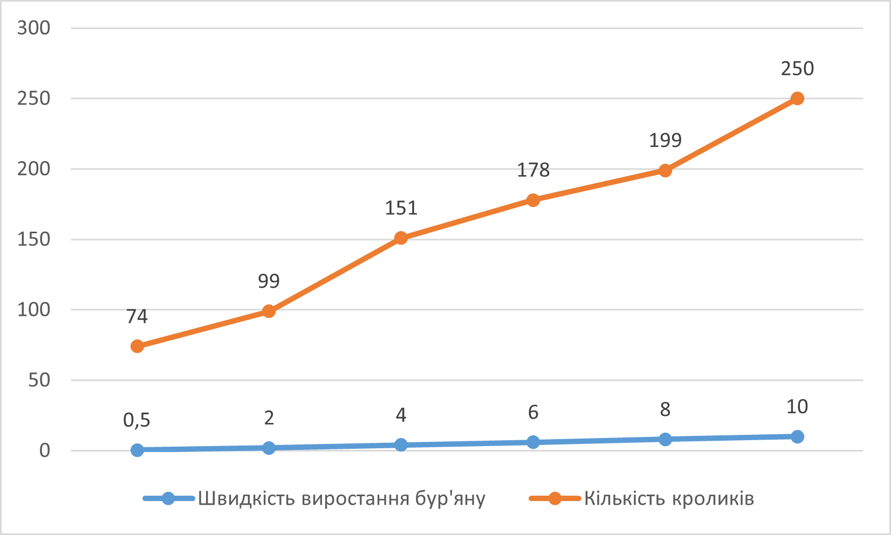

## Комп'ютерні системи імітаційного моделювання
## СПм-23-5, **Хромов Нікіта Олексійович**
### Лабораторна робота №**1**. Опис імітаційних моделей та проведення обчислювальних експериментів

 

### Варіант 6, модель у середовищі NetLogo:
[Rabbits Grass Weeds](http://www.netlogoweb.org/launch#http://www.netlogoweb.org/assets/modelslib/Sample%20Models/Biology/Rabbits%20Grass%20Weeds.nlogo)

 

### Вербальний опис моделі:
У цій простій екосистемі кролики переміщуються випадково, споживаючи траву або бур'яни, коли їх знаходять, що надає їм енергію. Кролики розмножуються при достатньому рівні енергії, а її нестача призводить до їх загибелі. Можна змінювати швидкість зростання трави і бур'янів, а також їхню енергетичну цінність для вивчення взаємного впливу цих параметрів.

Керуючі параметри:
- **number** – визначає кількість кролів.
- **birth-threshold** - встановлює рівень енергії, при досягненні якого кролики починають розмножуватися.
- **Grass-Growth-Rate** – регулює швидкість росту трави.
- **weeds-growth-rate** – керує темпом розвитку бур'янів.
- **grass-energy** – кількість енергії, що отримується від поїдання трави.
- **weed-energy** - енергія, що отримується від поїдання бур'янів.

### Показники роботи системи:
- **count rabbits** – поточна кількість кроликів.
- **Population** – діаграма, що відображає кількісні властивості трави, кроликів, бур'янів.

### Примітки:
- Населення кроликів піддається загасаючим коливанням, стабілізуючись у вузькому діапазоні. Загальна кількість трави коливається, не збігаючись із чисельністю кроликів.
- Кролики одержують енергію, внаслідок чого відбувається їхнє розмноження. Збільшення чисельності кроликів призводить до дефіциту трави та цикл повторюється.
- На початку процесу кроликам не вистачає трав, і багато з них гине. Однак це сприяє вільному зростанню трав, забезпечуючи достатньо їжі для кроликів, що вижили.

### Недоліки моделі:
- Відсутність моделювання конкуренції і боротьби за ресурси.
- Відсутність здібності для кроликів отруїться бур'янами.
- Відсутність розмежування кроликів на особі чоловічої, жіночої та дитячої статі.

 

## Обчислювальні експерименти
### 1. Залежність кількості кроликів від швидкості виростання трави
Метою експерименту є дослідження впливу швидкості росту трави на кількість кроликів за 200 тактів. Проводиться п’ять симуляцій при швидкостях від 1 до 20 одиниць з кроком 5.

Інші керуючі параметри мають значення за замовчуванням:
- **number** – 100
- **birth-threshold** - 15
- **weeds-growth-rate** – 0
- **grass-energy** – 5
- **weed-energy** - 0

<table>
<thead>
<tr><th>Швидкість виростання трави</th><th>Кількість кроликів</th></tr>
</thead>
<tbody>
<tr><td>1</td><td>0</td></tr>
<tr><td>5</td><td>120</td></tr>
<tr><td>10</td><td>148</td></tr>
<tr><td>15</td><td>222</td></tr>
<tr><td>20</td><td>278</td></tr>
</tbody>
</table>

Графік наочно показує, що при збільшенні кількості трави збільшується здатність кроликів розмножуватись а відповідно й кількість кроликів.

### 2. Залежність кількості кроликів від кількості енергії, що вони отримують від енергії трави
Вивчається вплив енергії, яку кролики отримують від трави, на їх кількість за 200 тактів. Проводиться шість симуляцій при рівнях енергії від 0,5 до 10 одиниць.

- **number** – 100
- **birth-threshold** - 15
- **Grass-Growth-Rate** – 5
- **weeds-growth-rate** – 0
- **weed-energy** - 0

<table>
<thead>
<tr><th>Енергія від трави</th><th>Кількість кроликів</th><th>Прожито тактів</th></tr>
</thead>
<tbody>
<tr><td>0,5</td><td>0</td><td>21</td></tr>
<tr><td>2</td><td>0</td><td>55</td></tr>
<tr><td>4</td><td>37</td><td>200</td></tr>
<tr><td>6</td><td>103</td><td>200</td></tr>
<tr><td>8</td><td>142</td><td>200</td></tr>
<tr><td>10</td><td>170</td><td>200</td></tr>
</tbody>
</table>

Графік показує, що підвищення енергії від трави збільшує кількість кроликів та покращує їх виживання.

### 3. Залежність кількості кроликів від кількості енергії, що вони отримують від бур'яну
Вивчається вплив енергії від бур'янів і трави на чисельність кроликів за 200 тактів. Проводиться шість симуляцій при рівнях енергії від 0,5 до 10 одиниць.

- **number** – 100
- **birth-threshold** - 15
- **Grass-Growth-Rate** – 5
- **weeds-growth-rate** – 5
- **grass-energy** – 5

<table>
<thead>
<tr><th>Енергія від бур'яну</th><th>Кількість кроликів</th></tr>
</thead>
<tbody>
<tr><td>0,5</td><td>74</td></tr>
<tr><td>2</td><td>99</td></tr>
<tr><td>4</td><td>151</td></tr>
<tr><td>6</td><td>178</td></tr>
<tr><td>8</td><td>199</td></tr>
<tr><td>10</td><td>250</td></tr>
</tbody>
</table>

Графік демонструє, що додавання бур'янів та підвищення енергії від них підвищують швидкість розмноження кроликів.

